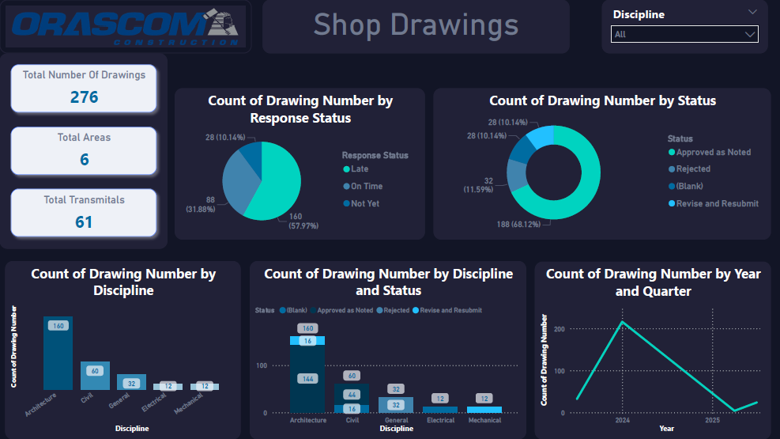

# Document-Control-Data-Analysis-Orascom-Construction-Internship

# 🏗️ Shop Drawings Dashboard - Orascom Construction

This repository contains the **Orascom Dashboard** project, developed using **Power BI** to provide insights into shop drawings, transmittals, and disciplines for construction project management.  

---

## 📊 Dashboard Overview  

The dashboard offers an interactive way to track and analyze project documentation, including:  

- **Total Number of Drawings**: 276  
- **Total Areas**: 6  
- **Total Transmittals**: 61  

### Key Insights  
- **Drawings by Discipline**  
  - Architecture: 160  
  - Civil: 60  
  - General: 32  
  - Electrical: 12  
  - Mechanical: 12  

- **Drawings by Year and Quarter**  
  - Covers **2024–2025** trends.  

- **Drawings by Discipline and Status**  
  - Approved as Noted  
  - Rejected  
  - Revise and Resubmit  
  - Pending  

- **Response Status**  
  - On Time: 57.97%  
  - Late: 31.88%  
  - Not Yet: 10.14%  

---

## ⚙️ Files Included  

- `Orascom Dashboard.pbix` → Power BI dashboard file.  
---

## 🚀 How to Use  

1. Download the `.pbix` file.  
2. Open it in **Power BI Desktop**.  
3. Explore, filter, and interact with the visuals.  

---

## 📌 Tools & Technologies  

- **Microsoft Power BI** (Data Visualization)  
- **Construction Project Documentation** (Shop Drawings & Transmittals)  

---

## 📷 Dashboard Preview  

  
 ---

## 👨‍💻 Author  

**Mohamed Amr**  
- Business Information Systems | Data Analyst  
- [LinkedIn]((https://www.linkedin.com/in/mohamed-amr009/)) | [GitHub](https://github.com)  

---

